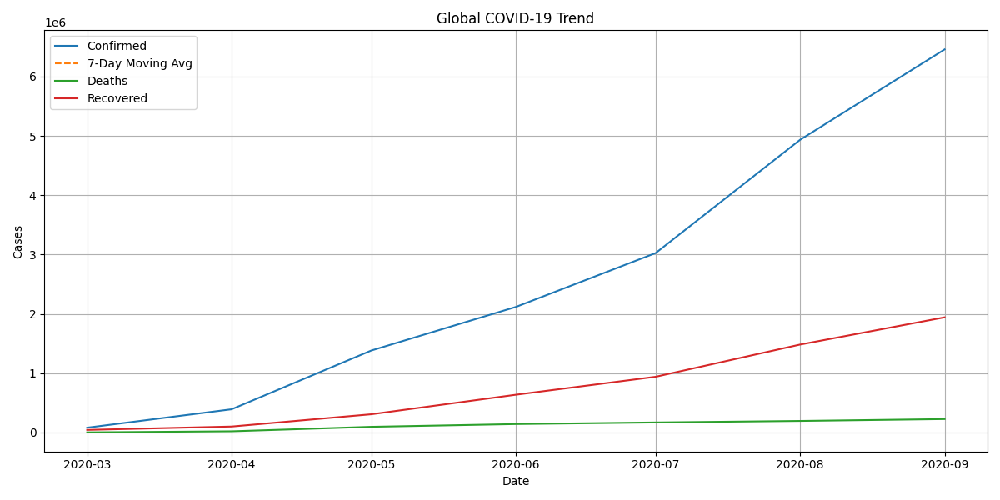

# COVID-19 Data Analysis 📊

## 🚀 Live Demo

👉 **Streamlit App:**  
https://covid19-data-analysis-bvj6ckwgsgqfcrhg6jsmzs.streamlit.app/

---

## 📊 Project Overview

This project analyzes global COVID-19 data and visualizes:
- Total Confirmed Cases
- Total Deaths
- Total Recovered
- Country-wise analysis
- Trend over time

Built using:
- Python
- Pandas
- Streamlit
- Altair

## Project Overview
This project analyzes global COVID-19 trends using Python.

## Features
- Global trend analysis
- Country-specific analysis
- Death rate & recovery rate calculation
- 7-day moving average
- Data visualization using Matplotlib

## 📊 Sample Visualization

## Technologies Used
- Python
- Pandas
- Matplotlib

## How to Run
1. Install requirements:
   pip install -r requirements.txt

2. Run:
   python src/analysis.py

## Author
Falguni Maththar
MCA Student | Aspiring Data Scientist | Aspiring Data Analyst